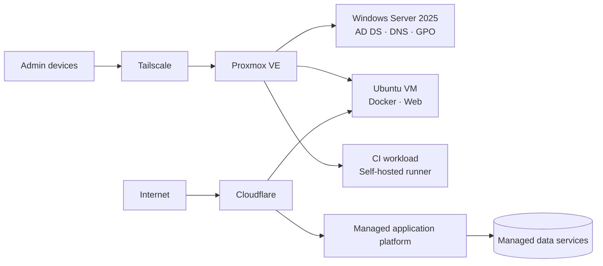

# Nick

### Production Infrastructure & Systems Administration

## Production work

| Project | Real infrastructure | Why this design |
| --- | --- | --- |
| **Fundacja Integracja poprzez Sztukę** | Dell PowerEdge · Proxmox VE · Windows Server 2025 · AD DS/DNS/GPO · LAPS · BitLocker · Ubuntu/Docker · VM backups · rollback · alerts · Tailscale | Hypervisor stays clean; workloads run in isolated VMs. Management access is private rather than exposed to the Internet. |
| **Tealista** | Cloudflare · Render · MongoDB Atlas · Cloudinary · GitHub Actions · self-hosted runner · deployment verification · production hardening | Customer-facing commerce stays on managed cloud services. Owned infrastructure is used where it reduces cost without increasing customer-facing risk. |

## Architecture

## Hands-on

**Windows:** AD DS · DNS · OU/groups · GPO · Windows LAPS · BitLocker · SCCM · troubleshooting  
**Infrastructure:** Proxmox VE · VM isolation · storage · networking · backup/restore  
**Linux:** Ubuntu Server · Docker / Compose · systemd · deployment / rollback  
**Automation:** PowerShell · GitHub Actions · self-hosted runners

## Public evidence

- **[PowerShell Corporate Automation](https://github.com/myducks/powershell-corp-automation)** — reusable Windows administration tooling
- **[Tealista Technical Case Study](https://github.com/myducks/tealista-case-study)** — architecture, commerce, CI/CD, security and production engineering

## Security

- Management plane is not publicly exposed
- No production credentials, tokens, internal addresses or recovery secrets are published
- Separate workloads are isolated in separate VMs
- Backup/recovery is independent from application deployment

> **Current trade-off:** one physical virtualization host remains a single point of failure. The current mitigation is backup-based recovery rather than high availability.

---

**Target:** System Administrator · Windows Administrator · IT Administrator · Infrastructure Support
