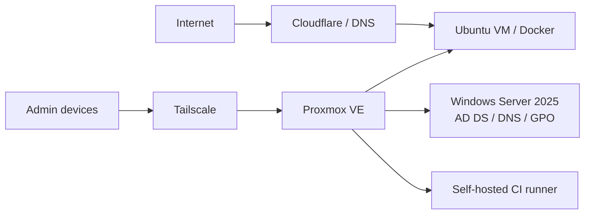

# Niki — IT Infrastructure & Systems Administration

**Windows Server · Active Directory · Proxmox VE · Linux · Docker · PowerShell · CI/CD**

I work in IT support and build production infrastructure for real services and organizations.

## Production infrastructure

### Fundacja Integracja poprzez Sztukę

- Dell PowerEdge + **Proxmox VE** production virtualization host
- **Windows Server 2025**: AD DS, DNS, OU/groups, GPO, Windows LAPS, BitLocker recovery
- **Ubuntu Server + Docker** for the production website
- Automated deployment, rollback, VM backups and operational alerts
- Remote administration through **Tailscale**; management interfaces are not exposed directly to the Internet

> **Decision:** keep the hypervisor as infrastructure only and run workloads in isolated VMs. Administrative access stays on a private management path instead of being publicly exposed.

### Tealista

- Commercial multi-vendor marketplace under active development
- Cloudflare, Render, MongoDB Atlas and Cloudinary production stack
- CI/CD with GitHub Actions and a **self-hosted runner** for selected workloads
- Infrastructure work includes deployment safety, rollback, performance, monitoring and production hardening

> **Decision:** customer-facing commerce services remain on managed cloud infrastructure while suitable automation/compute workloads can move to owned infrastructure. This limits operational risk without giving up cost control.

## Windows administration & automation

- Active Directory administration and troubleshooting
- GPO, Windows LAPS and BitLocker management
- SCCM / endpoint support
- PowerShell automation for repetitive Windows administration tasks

**Public project:** [PowerShell Corporate Automation](https://github.com/myducks/powershell-corp-automation)

> **Decision:** repetitive support actions should be scripted, predictable and auditable instead of performed manually on every endpoint.

## Production engineering

- Docker / Docker Compose
- Linux service administration and systemd
- GitHub Actions and self-hosted runners
- Backup and restore workflows
- Deployment health checks and rollback
- Secure remote administration

**Public case study:** [Tealista Case Study](https://github.com/myducks/tealista-case-study)

## Security model

`Internet-facing services` ≠ `management plane`

- No public Proxmox administration
- No credentials, tokens, internal addresses or recovery secrets in this portfolio
- Administrative access through private VPN connectivity
- Separate VMs for distinct workloads
- Backup and recovery designed separately from application deployment

> **Trade-off:** the current environment uses a single physical virtualization host, so host failure remains a single point of failure. Recovery is based on backups rather than high availability at the current scale.

---

**Target roles:** Junior System Administrator · Windows Administrator · IT Administrator · Infrastructure Support
